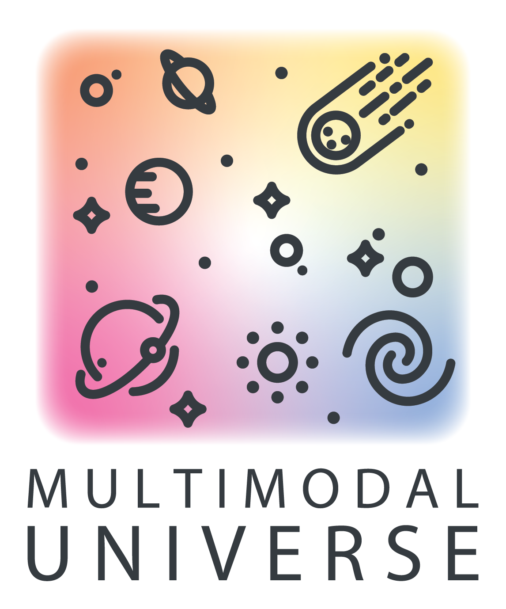

<div align="center">




# Multimodal Universe: Enabling Large-Scale Machine Learning with 100TBs of Astronomical Scientific Data

<a href="https://huggingface.co/MultimodalUniverse"></a>
[](https://openreview.net/forum?id=EWm9zR5Qy1) [](https://arxiv.org/abs/2412.02527) [](https://colab.research.google.com/github/MultimodalUniverse/MultimodalUniverse/blob/main/notebooks/getting_started.ipynb) [](https://github.com//MultimodalUniverse/MultimodalUniverse/actions/workflows/tiny_dset_test.yml) [](https://opensource.org/licenses/MIT)<!-- ALL-CONTRIBUTORS-BADGE:START - Do not remove or modify this section -->
[](#contributors-)
<!-- ALL-CONTRIBUTORS-BADGE:END -->
</div>

## Overview

The Multimodal Universe dataset is a large scale collection of multimodal astronomical data, including images, spectra, and light curves, which aims to enable research into foundation models for astrophysics and beyond.

## Quick Start

All datasets can be previewed directly from our [HuggingFace hub](https://huggingface.co/MultimodalUniverse) and accessed via `load_dataset('MultimodalUniverse/dataset_name')`! 
Preview datasets include ~1k examples from each survey.

```py
from datasets import load_dataset

dset = load_dataset('MultimodalUniverse/plasticc', 
                    split='train', streaming=True)

example = next(iter(dset))
```
**You can try this out with our [getting started notebook](https://colab.research.google.com/github/MultimodalUniverse/MultimodalUniverse/blob/main/notebooks/getting_started.ipynb)!**


## Data Access

To access the full dataset, we recommend downloading the data locally. This is necessary for using the provided cross-matching utilities.

The full dataset content is hosted at the Flatiron Institute and available either through HTTPS or through [GLOBUS](https://www.globus.org/):

 - https://users.flatironinstitute.org/~polymathic/data/MultimodalUniverse
 - https://app.globus.org/file-manager?origin_id=57136152-fc1d-418e-b74e-75ca52bddd21

GLOBUS is much preferable when downloading large amounts of data, or a large number of files. Local download of the full data in its native HDF5 format is necessary for using the provided cross-matching utilities.

After downloading the data, you can use Hugging Face's `datasets` library to load the data directly from your local copy. For example, to load the PLAsTiCC dataset:
```py
from datasets import load_dataset

dset = load_dataset('path/to/downloaded/plasticc', 
                    split='train', streaming=True)
dset = dset.with_format('numpy')

example = next(iter(dset))
```

## Datasets
The Multimodal Universe currently contains data from the following surveys/modalities:
| **Survey**           | **Modality**        | **Science Use Case** | **# samples** |
|----------------------|---------------------|----------------------|---------------|
| Legacy Surveys DR10  | Images              | Galaxies             | 124M          |
| Legacy Surveys North | Images              | Galaxies             | 15M           |
| HSC                  | Images              | Galaxies             | 477k          |
| BTS                  | Images              | Supernovae           | 400k          |
| JWST                 | Images              | Galaxies             | 180k          |
| Gaia BP/RP           | Spectra             | Stars                | 220M          |
| SDSS-II              | Spectra             | Galaxies, Stars      | 4M            |
| DESI                 | Spectra             | Galaxies             | 1M            |
| APOGEE SDSS-III      | Spectra             | Stars                | 716k          |
| GALAH                | Spectra             | Stars                | 325k          |
| Chandra              | Spectra             | Galaxies, Stars      | 129k          |
| VIPERS               | Spectra             | Galaxies             | 91k           |
| MaNGA SDSS-IV        | Hyperspectral Image | Galaxies             | 12k           |
| PLAsTiCC             | Time Series         | Time-varying objects | 3.5M          |
| TESS                 | Time Series         | Exoplanets           | 160k          |
| CfA Sample           | Time Series         | Supernovae           | 1k            |
| YSE                  | Time Series         | Supernovae           | 2k            |
| PS1 SNe Ia           | Time Series         | Supernovae           | 369           |
| DES Y3 SNe Ia        | Time Series         | Supernovae           | 248           |
| SNLS                 | Time Series         | Supernovae           | 239           |
| Foundation           | Time Series         | Supernovae           | 180           |
| CSP SNe Ia           | Time Series         | Supernovae           | 134           |
| Swift SNe Ia         | Time Series         | Supernovae           | 117           |
| Gaia                 | Tabular             | Stars                | 220M          |
| PROVABGS             | Tabular             | Galaxies             | 221k          |
| Galaxy10 DECaLS      | Tabular             | Galaxies             | 15k           |
| GALEX All-Sky Imaging| Tabular             | Stars                | 83M           |
| SAGES DR1            | Tabular             | Stars                | 48.5M         |
| 2MASS PSC            | Tabular             | Galaxies, Stars      | 471M          |

We are accepting new datasets! Check out our [contribution guidelines](./CONTRIBUTING.md) for more details.

## Data License

We openly distribute the Multimodal Universe dataset under the [Creative Commons Attribution (CC BY) 4.0](https://creativecommons.org/licenses/by/4.0/) license, noting however that when using specific subsets, the license and conditions of utilisation should be respected.

## Architecture
<center>

</center>

Illustration of the methodology behind the Multimodal Universe. Domain scientists with expertise in a given astronomical survey provide data download and formatting scripts through Pull Requests. All datasets are then downloaded from their original source and made available as Hugging Face datasets sharing a common data schema for each modality and associated metadata. End-users can then generate any combination of subsets using provided cross-matching utilities to generate multimodal datasets.

Please see the [Design Document](https://github.com/MultimodalUniverse/MultimodalUniverse/blob/main/DESIGN.md) for more context about the project. 

## Citations & Acknowledgements

If you make use of all or part of the Multimodal Universe dataset, please cite the individual datasets accordingly. The relevant BibTeX citations and text acknowledgement instructions for datasets can be generated through the [info.py](scripts/info.py) file (`python scripts/info.py --help` for details).

It allows you to retrieve all of the dataset information, or just acknowledgement and citation information for some or all datasets. By not specifying a dataset, it will return all datasets. By not specifying at least one of `--citation` or `--acknowledge`, it will return all of the information (including license, homepage, etc.).
```sh
python scripts/info.py --cite --data <datasets>
python scripts/info.py --acknowledge --data <datasets>
```
For example, to get the citations for the APOGEE and SDSS datasets and save them to `info_citation.bib`, run:
```sh
python scripts/info.py --cite --data apogee sdss -o info_citation.bib
To get all citations and acknowledgements, run:
```sh
python scripts/info.py --cite --acknowledge
```
You can always specify an output file for easy transcription to your bibliography or acknowledgements section with the `--output` flag:
```sh
python scripts/info.py --cite --output full_citations.txt
python scripts/info.py --acknowledge --output full_acknowledgements.txt
```

Acknowledgement instructions are returned alongside citations to encourage attribution. The acknowledgement lines are commented with `%` to make the citations easy to add to your bibliography.


## Contributors

#### Full Contribution List
<!-- ALL-CONTRIBUTORS-LIST:START - Do not remove or modify this section -->
<!-- prettier-ignore-start -->
<!-- markdownlint-disable -->
<table>
  <tbody>
    <tr>
      <td align="center" valign="top" width="14.28%"><a href="http://flanusse.net/"><br /><sub><b>Francois Lanusse</b></sub></a><br /><a href="#projectManagement-EiffL" title="Project Management">📆</a> <a href="#example-EiffL" title="Examples">💡</a> <a href="https://github.com/MultimodalUniverse/MultimodalUniverse/commits?author=EiffL" title="Code">💻</a></td>
      <td align="center" valign="top" width="14.28%"><a href="https://github.com/lhparker1"><br /><sub><b>Liam Parker</b></sub></a><br /><a href="#projectManagement-lhparker1" title="Project Management">📆</a> <a href="#example-lhparker1" title="Examples">💡</a> <a href="https://github.com/MultimodalUniverse/MultimodalUniverse/commits?author=lhparker1" title="Code">💻</a></td>
      <td align="center" valign="top" width="14.28%"><a href="https://mb010.github.io/"><br /><sub><b>Micah Bowles</b></sub></a><br /><a href="#projectManagement-mb010" title="Project Management">📆</a> <a href="#example-mb010" title="Examples">💡</a> <a href="https://github.com/MultimodalUniverse/MultimodalUniverse/commits?author=mb010" title="Code">💻</a></td>
      <td align="center" valign="top" width="14.28%"><a href="https://github.com/mhuertascompany"><br /><sub><b>mhuertascompany</b></sub></a><br /><a href="#projectManagement-mhuertascompany" title="Project Management">📆</a> <a href="#example-mhuertascompany" title="Examples">💡</a> <a href="https://github.com/MultimodalUniverse/MultimodalUniverse/commits?author=mhuertascompany" title="Code">💻</a></td>
      <td align="center" valign="top" width="14.28%"><a href="https://mjjsmith.com/"><br /><sub><b>Mike Smith</b></sub></a><br /><a href="#projectManagement-Smith42" title="Project Management">📆</a> <a href="#example-Smith42" title="Examples">💡</a> <a href="https://github.com/MultimodalUniverse/MultimodalUniverse/commits?author=Smith42" title="Code">💻</a></td>
      <td align="center" valign="top" width="14.28%"><a href="https://github.com/helenqu"><br /><sub><b>Helen Qu</b></sub></a><br /><a href="#projectManagement-helenqu" title="Project Management">📆</a> <a href="#example-helenqu" title="Examples">💡</a> <a href="https://github.com/MultimodalUniverse/MultimodalUniverse/commits?author=helenqu" title="Code">💻</a></td>
      <td align="center" valign="top" width="14.28%"><a href="https://github.com/ado8"><br /><sub><b>Aaron</b></sub></a><br /><a href="#example-ado8" title="Examples">💡</a> <a href="https://github.com/MultimodalUniverse/MultimodalUniverse/commits?author=ado8" title="Code">💻</a></td>
    </tr>
    <tr>
      <td align="center" valign="top" width="14.28%"><a href="https://cdtdis.bigdata.cam.ac.uk/author/boyd01/"><br /><sub><b>Ben Boyd</b></sub></a><br /><a href="#example-benboyd97" title="Examples">💡</a> <a href="https://github.com/MultimodalUniverse/MultimodalUniverse/commits?author=benboyd97" title="Code">💻</a></td>
      <td align="center" valign="top" width="14.28%"><a href="https://github.com/havok2063"><br /><sub><b>Brian Cherinka</b></sub></a><br /><a href="https://github.com/MultimodalUniverse/MultimodalUniverse/commits?author=havok2063" title="Code">💻</a></td>
      <td align="center" valign="top" width="14.28%"><a href="https://connorjstone.com/"><br /><sub><b>Connor Stone, PhD</b></sub></a><br /><a href="#example-ConnorStoneAstro" title="Examples">💡</a></td>
      <td align="center" valign="top" width="14.28%"><a href="https://github.com/David-Chemaly"><br /><sub><b>David Chemaly</b></sub></a><br /><a href="#example-David-Chemaly" title="Examples">💡</a> <a href="https://github.com/MultimodalUniverse/MultimodalUniverse/commits?author=David-Chemaly" title="Code">💻</a></td>
      <td align="center" valign="top" width="14.28%"><a href="https://www.ast.cam.ac.uk/people/Erin.Hayes"><br /><sub><b>Erin Hayes</b></sub></a><br /><a href="#example-erinhay" title="Examples">💡</a> <a href="https://github.com/MultimodalUniverse/MultimodalUniverse/commits?author=erinhay" title="Code">💻</a></td>
      <td align="center" valign="top" width="14.28%"><a href="https://henrysky.github.io/"><br /><sub><b>Henry Leung</b></sub></a><br /><a href="https://github.com/MultimodalUniverse/MultimodalUniverse/commits?author=henrysky" title="Code">💻</a></td>
      <td align="center" valign="top" width="14.28%"><a href="https://www.jociuca.com/"><br /><sub><b>Ioana Ciucă</b></sub></a><br /><a href="#content-errai34" title="Content">🖋</a></td>
    </tr>
    <tr>
      <td align="center" valign="top" width="14.28%"><a href="https://github.com/al-jshen"><br /><sub><b>Jeff Shen</b></sub></a><br /><a href="https://github.com/MultimodalUniverse/MultimodalUniverse/commits?author=al-jshen" title="Code">💻</a></td>
      <td align="center" valign="top" width="14.28%"><a href="https://github.com/jeraud"><br /><sub><b>jeraud</b></sub></a><br /><a href="#example-jeraud" title="Examples">💡</a> <a href="https://github.com/MultimodalUniverse/MultimodalUniverse/commits?author=jeraud" title="Code">💻</a></td>
      <td align="center" valign="top" width="14.28%"><a href="https://jwuphysics.github.io/"><br /><sub><b>John F. Wu</b></sub></a><br /><a href="#content-jwuphysics" title="Content">🖋</a></td>
      <td align="center" valign="top" width="14.28%"><a href="https://github.com/CambridgeAstroStat"><br /><sub><b>CambridgeAstroStat</b></sub></a><br /><a href="#mentoring-CambridgeAstroStat" title="Mentoring">🧑‍🏫</a></td>
      <td align="center" valign="top" width="14.28%"><a href="https://kartheikiyer.github.io/"><br /><sub><b>Kartheik Iyer</b></sub></a><br /><a href="https://github.com/MultimodalUniverse/MultimodalUniverse/commits?author=kartheikiyer" title="Code">💻</a></td>
      <td align="center" valign="top" width="14.28%"><a href="https://ltmeyer.github.io/"><br /><sub><b>Lucas Meyer</b></sub></a><br /><a href="https://github.com/MultimodalUniverse/MultimodalUniverse/commits?author=LTMeyer" title="Code">💻</a></td>
      <td align="center" valign="top" width="14.28%"><a href="https://github.com/mattgrayling"><br /><sub><b>Matthew Grayling</b></sub></a><br /><a href="#example-mattgrayling" title="Examples">💡</a> <a href="https://github.com/MultimodalUniverse/MultimodalUniverse/commits?author=mattgrayling" title="Code">💻</a></td>
    </tr>
    <tr>
      <td align="center" valign="top" width="14.28%"><a href="https://github.com/maja-jablonska"><br /><sub><b>Maja Jabłońska</b></sub></a><br /><a href="https://github.com/MultimodalUniverse/MultimodalUniverse/commits?author=maja-jablonska" title="Code">💻</a></td>
      <td align="center" valign="top" width="14.28%"><a href="https://github.com/mwalmsley"><br /><sub><b>Mike Walmsley</b></sub></a><br /><a href="#example-mwalmsley" title="Examples">💡</a> <a href="https://github.com/MultimodalUniverse/MultimodalUniverse/commits?author=mwalmsley" title="Code">💻</a></td>
      <td align="center" valign="top" width="14.28%"><a href="https://github.com/MilesCranmer"><br /><sub><b>Miles Cranmer</b></sub></a><br /><a href="#content-MilesCranmer" title="Content">🖋</a></td>
      <td align="center" valign="top" width="14.28%"><a href="http://pmelchior.net/"><br /><sub><b>Peter Melchior</b></sub></a><br /><a href="https://github.com/MultimodalUniverse/MultimodalUniverse/commits?author=pmelchior" title="Code">💻</a></td>
      <td align="center" valign="top" width="14.28%"><a href="https://github.com/juramaga"><br /><sub><b>Rafael Martínez-Galarza</b></sub></a><br /><a href="https://github.com/MultimodalUniverse/MultimodalUniverse/commits?author=juramaga" title="Code">💻</a></td>
      <td align="center" valign="top" width="14.28%"><a href="https://github.com/tom-hehir"><br /><sub><b>Tom Hehir</b></sub></a><br /><a href="#example-tom-hehir" title="Examples">💡</a> <a href="https://github.com/MultimodalUniverse/MultimodalUniverse/commits?author=tom-hehir" title="Code">💻</a></td>
      <td align="center" valign="top" width="14.28%"><a href="https://github.com/shirleysurelyho"><br /><sub><b>Shirley Ho</b></sub></a><br /><a href="#fundingFinding-shirleysurelyho" title="Funding Finding">🔍</a> <a href="#content-shirleysurelyho" title="Content">🖋</a></td>
    </tr>
    <tr>
      <td align="center" valign="top" width="14.28%"><a href="http://marielpettee.com"><br /><sub><b>Mariel Pettee</b></sub></a><br /><a href="#ideas-mariel-pettee" title="Ideas, Planning, & Feedback">🤔</a> </td>
    </tr>
  </tbody>
</table>

<!-- markdownlint-restore -->
<!-- prettier-ignore-end -->

<!-- ALL-CONTRIBUTORS-LIST:END -->
